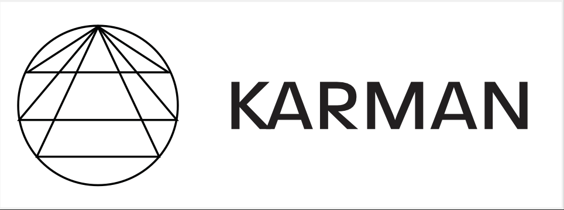

[](https://github.com/spaceml-org/karman/actions/workflows/install.yaml) 

Karman - Data Driven Thermospheric Density Nowcast and Forecast with Machine Learning
<!-- PROJECT LOGO -->
<br />
<p align="center">
  <a href="https://spaceml-org.github.io/karman/">
    
  </a>
  <p align="center">
    Karman
    <br />
    <a href="https://spaceml-org.github.io/karman/"><strong>Explore the docs »</strong></a>
    <br />
    <br />
    <a href="https://github.com/spaceml-org/karman/issues/new/choose">Report bug</a>
    ·
    <a href="https://github.com/spaceml-org/karman/issues/new/choose">Request feature</a>
  </p>
</p>

Karman is a machine learning (ML) Python package for thermospheric density modelling. It was developed as a collaboration between the Heliophysics Division of NASA and [Trillium Technologies](https://trillium.tech/). 

Its main goal is to improve our understanding and modeling of thermospheric density variations due to the Sun's influence. Furthermore, it also has the objective to provide a shared framework where people can design, train and benchmark their own thermospheric density models.

## Goals

* Release of ML models to nowcast & forecast thermospheric density changes from solar and geomagnetic data, trained on precise orbit determination (POD)-derived thremospheric density measurements. 
* A framework to support ingestion of solar irradiance, geomagnetic and thermospheric density data from different sources. Currently, it supports data from: solar indexes (F10.7, M10.7, S10.7, Y10.7), geomagnetic indixes (Dst, Ap), SOHO EUV irradiance data, OMNIWeb high-resolution data, GOES EUV irradiance missions, POD-derived thermospheric density data.
* Framework to enable comparison between ML and empirical models at different geomagnetic storm conditions, altitude, times, etc.

## Supported Data

Currently, the Karman software supports several input data from different sources:
* High frequency (i.e., every 30 or 10 seconds) POD-derived thermospheric density data from five space missions (CHAMP, GOCE, GRACE, SWARM-A, SWARM-B), from [TU Delft thermosphere data](http://thermosphere.tudelft.nl/).
* NRLMSISE-00 thermospheric density empirical models inputs (and corresponding predicted density).
* Geomagnetic input data from [NASA's OMNIWeb high resolution data](https://omniweb.gsfc.nasa.gov/form/omni_min.html).
* Solar irradiance proxies commonly used in empirical thermospheric density models (i.e., F10.7, S10.7, M10.7, Y10.7).
* EUV Irradiance data from SOHO mission (from [LASP](https://lasp.colorado.edu/eve/data_access/eve_data/lasp_soho_sem_data/) website)
* EUV Irradiance data from GOES mission (from [NOAA](https://www.ncei.noaa.gov/data/goes-space-environment-monitor/access/science/euvs/) website)

We have dedicated tutorials and scripts to download and prepare each of these data sources for ML ingestion.


## Installation, documentation, and examples

https://spaceml-org.github.io/karman/

## Authors:
Currently active contributors are:
* [Giacomo Acciarini](https://www.esa.int/gsp/ACT/team/giacomo_acciarini/)
* [James Walsh](https://walsh.dev/)

Many other people contributed to Karman since 2021 over the course of several FDLs. For a list of previous and current contributors see the "credits" page in the doc. 

## More info and how to cite:

If you would like to learn more about or cite the techniques Karman uses, please see the following papers:

* Giacomo Acciarini, Edward Brown, Thomas E. Berger, Madhulika Guhathakurta, James Parr, Christopher Bridges, Atılım Güneş Baydin. 2024. ["Improving Thermospheric Density Predictions in Low-Earth Orbit with Machine Learning"](https://agupubs.onlinelibrary.wiley.com/doi/pdfdirect/10.1029/2023SW003652). In Space Weather Journal.

```bibtex
@article{acciarini2024improving,
  title={Improving Thermospheric Density Predictions in Low-Earth Orbit With Machine Learning},
  author={Acciarini, Giacomo and Brown, Edward and Berger, Tom and Guhathakurta, Madhulika and Parr, James and Bridges, Christopher and Baydin, At{\i}l{\i}m G{\"u}ne{\c{s}}},
  journal={Space Weather},
  volume={22},
  number={2},
  pages={e2023SW003652},
  year={2024},
  publisher={Wiley Online Library}
}
```

* Giacomo Acciarini, Edward Brown, Christopher Bridges, Atılım Güneş Baydin, Thomas E. Berger, Madhulika Guhathakurta. 2023. ["Karman - a Machine Learning Software Package for Benchmarking Thermospheric Density Models"](https://www.researchgate.net/publication/374005215_Karman_-a_Machine_Learning_Software_Package_for_Benchmarking_Thermospheric_Density_Models). In Advanced Maui Optical and Space Surveillance Technologies Conference (AMOS) – www.amostech.com.


```bibtex
@inproceedings{karman-amos-acciarini,
  author    = {Giacomo Acciarini and Edward Brown and Christopher Bridges and Atılım Güneş Baydin and Thomas E. Berger and Madhulika Guhathakurta},
  title     = {Karman - a Machine Learning Software Package for Benchmarking Thermospheric Density Models},
  booktitle = {Proceedings of the Advanced Maui Optical and Space Surveillance Technologies Conference (AMOS)},
  year      = {2023},
  month     = {September},
  day       = {19},
}
```

* Shreshth Malik, James Walsh, Giacomo Acciarini, Thomas Berger, At{\i}l{\i}m G{\"u}ne{\c{s}}} Baydin. 2023. ["High-Cadence Thermospheric Density Estimation enabled by Machine Learning on Solar Imagery"](https://ml4physicalsciences.github.io/2023/files/NeurIPS_ML4PS_2023_237.pdf). In NeurIPS, Machine Learning and the Physical Sciences Workshop.
* 
```bibtex
@article{malik2023high,
  title={High-Cadence Thermospheric Density Estimation enabled by Machine Learning on Solar Imagery},
  author={Malik, Shreshth A and Walsh, James and Acciarini, Giacomo and Berger, Thomas E and Baydin, At{\i}l{\i}m G{\"u}ne{\c{s}}},
  booktitle={NeurIPS, Machine Learning and the Physical Sciences Workshop},
  year={2023},
  month={December}
}
```

## Acknowledgements:

The authors would like to ackowledge the support and precious feedback of several people: [Dr. Madhulika Guhathakurta](https://science.nasa.gov/about-us/organization-and-leadership/lead-program-scientist-for-lws), and all the NASA-FDL 2021, 2023, 2024 reviewers.

## Contact:
* `giacomo.acciarini@gmail.com`
