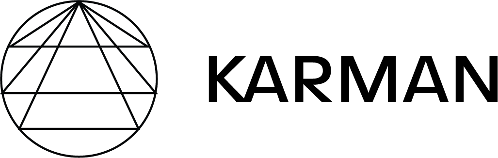
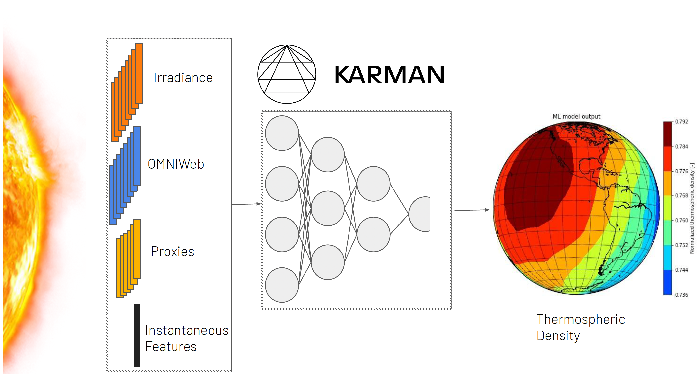

[](https://github.com/spaceml-org/karman/actions/workflows/install-and-test.yaml) 
[](https://codecov.io/gh/Sceki/karman-private)
[](https://karman-project.readthedocs.io/en/latest/?badge=latest)


<!-- PROJECT LOGO -->
<br />
<p align="center">
  <a href="https://github.com/spaceml-org/karman">
    
  </a>
  <p align="center">
    Karman: Data Driven Thermospheric Density Modeling
    <br />
    <a href="https://readthedocs.org/projects/karman-project/"><strong>Explore the docs »</strong></a>
    <br />
    <br />
    <a href="https://github.com/spaceml-org/karman/issues">Report Bug</a>
    ·
    <a href="https://github.com/spaceml-org/karman/issues">Request Feature</a>
  </p>
</p>

Karman is a machine learning (ML) Python package for thermospheric density modelling. It was developed as a collaboration between the Heliophysics Division of NASA and [Trillium Technologies](https://trillium.tech/) under a NASA-funded Sole Source project. Its main goal is to improve our understanding and modeling of thermospheric density variations due to the Sun's influence. Furthermore, it also has the objective to provide a shared framework where people can design, train and benchmark their own thermospheric density models.

## Goals

* Release of ML models to predict thermospheric density changes from solar and geomagnetic data, trained on precise orbit determination (POD)-derived thremospheric density measurements. 
* A framework to support ingestion of solar irradiance, geomagnetic and thermospheric density data from different sources.
* Benchmarking framework to enable comparison between ML and empirical models at different geomagnetic storm conditions, altitude, times, etc.

## Supported Data

Currently, the Karman software supports several input data from different sources:
* High frequency (i.e., every 30 or 10 seconds) POD-derived thermospheric density data from five space missions (CHAMP, GOCE, GRACE, SWARM-A, SWARM-B), from [TU Delft thermosphere data](http://thermosphere.tudelft.nl/).
* NRLMSISE-00 and JB-08 thermospheric density empirical models inputs (and corresponding predicted density).
* Geomagnetic input data from [NASA's OMNIWeb high resolution data](https://omniweb.gsfc.nasa.gov/form/omni_min.html).
* [EUV Stan Bands from FISM2](https://lasp.colorado.edu/lisird/data/fism_flare_bands/) empirical model (both daily and flare).
* Solar irradiance proxies commonly used in empirical thermospheric density models (i.e., F10.7, S10.7, M10.7, Y10.7).



## Installation, documentation, and examples

https://readthedocs.org/projects/karman-project/

## Authors:
* [Giacomo Acciarini](https://www.surrey.ac.uk/people/giacomo-acciarini)
* [Edward Brown](https://www.cst.cam.ac.uk/people/ejeb4)
* [Atılım Güneş Baydin](http://gbaydin.github.io/)
* [Chris Bridges](https://www.surrey.ac.uk/people/chris-bridges)

The project originated after the initial work of the [NASA-FDL 2021](https://frontierdevelopmentlab.org/fdl-2021) Solar Drag team, funded by the Heliophysics Division of NASA.

Solar Drag team members: Researchers: Stefano Bonasera, Edward Brown, Jorge A. Pérez-Hernández, Bernard Benson; Faculty: Giacomo Acciarini, Atılım Güneş Baydin, Chris Bridges; Advisors: Eric Sutton, Moriba K. Jah.

## More info and how to cite:

If you would like to learn more about or cite the techniques Karman uses, please see the following papers:

* Giacomo Acciarini, Edward Brown, Christopher Bridges, Atılım Güneş Baydin, Thomas E. Berger, Madhulika Guhathakurta. 2023. ["Karman - a Machine Learning Software Package for Benchmarking Thermospheric Density Models"](https://www.researchgate.net/publication/374005215_Karman_-a_Machine_Learning_Software_Package_for_Benchmarking_Thermospheric_Density_Models). In Advanced Maui Optical and Space Surveillance Technologies Conference (AMOS) – www.amostech.com.

```
@inproceedings{karman-amos-acciarini,
  author    = {Giacomo Acciarini and Edward Brown and Christopher Bridges and Atılım Güneş Baydin and Thomas E. Berger and Madhulika Guhathakurta},
  title     = {Karman - a Machine Learning Software Package for Benchmarking Thermospheric Density Models},
  booktitle = {Proceedings of the Advanced Maui Optical and Space Surveillance Technologies Conference (AMOS)},
  year      = {2023},
  month     = {September},
  day       = {19},
}
```

## Acknowledgements:

The authors would like to ackowledge the support and precious feedback of several people: [Dr. Madhulika Guhathakurta](https://science.nasa.gov/about-us/organization-and-leadership/lead-program-scientist-for-lws), [Tom Berger](https://www.colorado.edu/spaceweather/thomas-berger), and all the NASA-FDL 2021 reviewers.

## Contact:
* `giacomo.acciarini@gmail.com`
